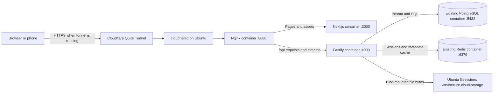
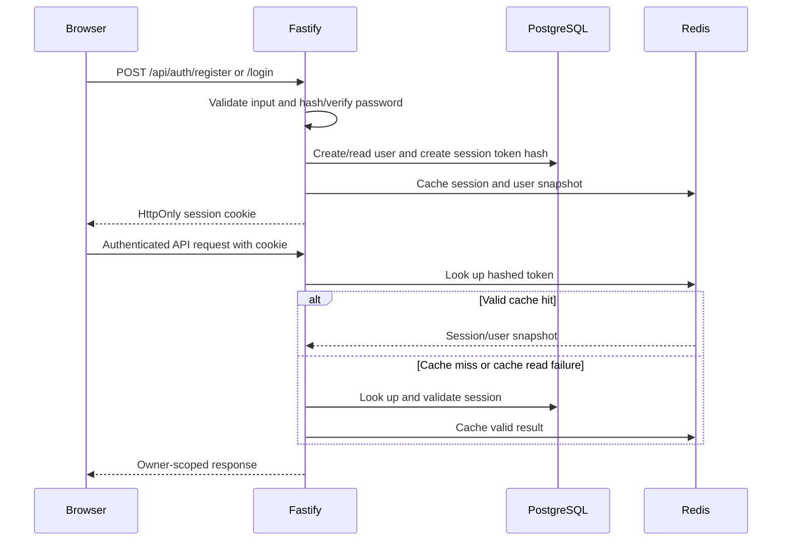
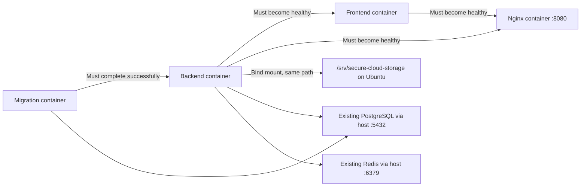
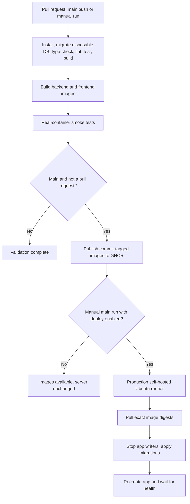

# Secure-Cloud: current code flow and infrastructure

**Verified runtime snapshot:** 6 September 2026, approximately 20:23 PKT (15:23 UTC).

This document describes the first-party application code, database schema, storage adapter, frontend, Docker files, tests and GitHub Actions workflow. The running-system observations are a point-in-time snapshot of the Ubuntu laptop. Dependencies and generated build output are not application source. No credentials, session tokens or user file contents are reproduced here.

## 1. What the project does

Secure-Cloud is a single-server file storage application. Next.js renders the interface; the browser calls a Fastify API for authentication and file operations. PostgreSQL stores account/session data and file metadata. Actual uploaded bytes live in `/srv/secure-cloud-storage` on the Ubuntu laptop. Redis caches sessions and selected metadata and supports authentication rate limiting.

The enforced quota is **5 GiB per user**, exactly `5368709120` bytes. Uploads and downloads pass through the backend. There is no active object-storage SDK, remote upload URL generation, or external file-storage service in the runtime code.



The browser uses the relative API base `/api`, so mobile requests stay on the same public hostname as the page. Nginx sends `/api/*` to Fastify and other paths to Next.js. Next.js also supplies an `/api/*` rewrite to the local backend for direct development access. No business logic has moved out of Fastify.

## 2. Infrastructure actually running at inspection time

| Component | Verified state | Persistence / purpose |
| --- | --- | --- |
| Ubuntu laptop | Host for all application services and uploaded files | Single-machine deployment |
| Nginx | `secure-cloud-nginx-1`, `nginx:stable-alpine`, healthy | Entry point on port 8080; configuration bind-mounted read-only |
| Backend | `secure-cloud-backend-1`, `secure-cloud-backend:local`, healthy | Compiled Fastify API on port 4000, `NODE_ENV=production` |
| Frontend | `secure-cloud-frontend-1`, `secure-cloud-frontend:local`, healthy | Standalone production Next.js on port 3000 |
| Migrations | `secure-cloud-migrate-1`, exited with code 0 | One-shot Prisma migration job; successful exit is expected |
| PostgreSQL | `self-cloud-prj-postgres-1`, `postgres:17-alpine`, healthy | Compose-managed database, published only on 127.0.0.1:5432 |
| Redis | `self-cloud-prj-redis-1`, `redis:7.4-alpine`, healthy | Compose-managed cache, published only on 127.0.0.1:6379 |
| Upload directory | `/srv/secure-cloud-storage`, owner `aneeb-kashif:aneeb-kashif`, mode `0755` | File bytes stored on Ubuntu and bind-mounted into the backend |
| Cloudflare connector | No running `cloudflared` process observed | Quick Tunnel must be started separately for public/mobile access |
| GitHub Actions / GHCR | Workflow exists locally | Remote runs, published images, runner registration and environment settings were not verified |

The `secure-cloud` Compose project now manages the application, PostgreSQL, Redis and monitoring through the included `monitoring/compose.yaml`. The original database volumes are preserved; database ports bind only to localhost. See [monitoring operations](monitoring/README.md) for adoption and recovery.

The **existing database containers use named Docker volumes**:

| Existing volume | Container path | Host data directory |
| --- | --- | --- |
| `self-cloud-prj_postgres_data` | `/var/lib/postgresql/data` | `/var/lib/docker/volumes/self-cloud-prj_postgres_data/_data` |
| `self-cloud-prj_redis_data` | `/data` | `/var/lib/docker/volumes/self-cloud-prj_redis_data/_data` |

These volumes hold database/cache data, not uploaded-file bytes. Uploaded files use the separate host bind mount. The current Compose file declares no named volumes of its own.

Application and monitoring services use Linux host networking. PostgreSQL and Redis use a bridge network with published localhost-only ports. Blank port mappings in `docker compose ps` for the application containers are therefore expected.

The running backend environment was checked selectively: `NODE_ENV=production`, `FRONTEND_ORIGIN=*`, `STORAGE_PATH=/srv/secure-cloud-storage`, and `STORAGE_LIMIT_BYTES=5368709120`. Compose overrides development defaults from `backend/.env`. The normal local Compose environment source is `backend/.env`; the optional GitHub deployment job instead expects `/etc/secure-cloud/backend.env` through `APP_ENV_FILE`.

Fresh checks through Nginx returned:

| Check | Result |
| --- | --- |
| `GET http://127.0.0.1:8080/login` | HTTP 200 |
| `GET http://127.0.0.1:8080/api/files` without a cookie | HTTP 401, as expected for protected data |
| `GET http://127.0.0.1:8080/health` | `{"status":"ok","redis":"ready"}` |
| Migration container status | `Exited (0)` |

The local-storage migration was confirmed applied during the earlier schema inspection; the current migration job also completed successfully. The health route reports API liveness and Redis client state, but does not execute a database query or disk check on every request.

To make the current local stack available through the user's Quick Tunnel setup, run `cloudflared tunnel --url http://localhost:8080` and keep it running. Use its generated HTTPS URL on the phone. A local healthy stack does not by itself establish that a public tunnel is active.

## 3. Where the code lives

| Area | Main files | Responsibility |
| --- | --- | --- |
| Workspace commands | [package.json](package.json) | Starts both development workspaces; runs builds, type-checks and backend tests |
| API entry point | [backend/src/server.ts](backend/src/server.ts) | Starts listening and handles shutdown signals |
| API composition | [backend/src/app.ts](backend/src/app.ts) | Creates services, registers security plugins, error handling and routes |
| Configuration | [backend/src/config.ts](backend/src/config.ts) | Loads dotenv values and validates them with Zod |
| Authentication | [backend/src/plugins/auth.ts](backend/src/plugins/auth.ts), [auth routes](backend/src/modules/auth/routes.ts) | Password verification, session creation, cookie authentication and logout |
| File operations | [backend/src/modules/files/routes.ts](backend/src/modules/files/routes.ts) | Upload, search/list, details, download, move and permanent delete |
| Disk operations | [backend/src/lib/storage.ts](backend/src/lib/storage.ts) | Safe UUID paths, streamed writes/reads and unlink |
| Folder operations | [backend/src/modules/folders/routes.ts](backend/src/modules/folders/routes.ts) | Logical folder tree, creation, rename and empty-folder deletion |
| Quota display/recalculation | [backend/src/modules/storage/routes.ts](backend/src/modules/storage/routes.ts) | Storage summary and per-user recalculation |
| Redis | [redis.ts](backend/src/lib/redis.ts), [cache.ts](backend/src/lib/cache.ts) | JSON cache access, key naming and invalidation |
| Response/error helpers | `backend/src/lib/serialize.ts`, `errors.ts`, `types.d.ts` | BigInt conversion, application errors and Fastify type extensions |
| Database | [backend/prisma/schema.prisma](backend/prisma/schema.prisma), `backend/prisma/migrations/` | Models and versioned schema changes |
| Offline maintenance | [recalculate-storage.ts](backend/src/scripts/recalculate-storage.ts) | Rebuilds usage counters from file metadata for all users |
| Frontend shell | [frontend/components/app-shell.tsx](frontend/components/app-shell.tsx) | Navigation, session lookup, logout, mobile menu and theme |
| Login/register | [frontend/components/auth-form.tsx](frontend/components/auth-form.tsx) | Shared form and API submission |
| File interface | [frontend/components/file-manager.tsx](frontend/components/file-manager.tsx) | Folder selection, upload progress, search, sorting, pagination and deletion modal |
| Storage interface | [frontend/components/storage-summary.tsx](frontend/components/storage-summary.tsx) | Usage/count display fetched from `/api/storage` |
| Browser networking | [frontend/lib/api.ts](frontend/lib/api.ts) | Credentialed fetch, binary upload through XHR and byte formatting |
| Styling | `frontend/app/globals.css`, `frontend/postcss.config.mjs` | Tailwind 4, light/dark CSS variables and terminal-style visual components |
| Next.js configuration | [frontend/next.config.ts](frontend/next.config.ts) | Standalone builds, workspace file tracing and separate dev/build directories |
| Deployment | [compose.yaml](compose.yaml), both workspace Dockerfiles, [deploy/README.md](deploy/README.md) | Application containers, migrations and deployment instructions |
| Automation | [pipeline.yml](.github/workflows/pipeline.yml), `.github/dependabot.yml` | CI, image publication, optional deployment and dependency-update configuration |
| Tests | `backend/test/`, [scripts/smoke-containers.sh](scripts/smoke-containers.sh), [scripts/smoke-http.mjs](scripts/smoke-http.mjs) | Filesystem, API/database and actual-container checks |
| Infrastructure placeholder | `infra/ec2.tf` | Empty, zero-byte file; it provisions no infrastructure |

## 4. Startup and request handling

### Current Docker startup

The active stack was started with Compose. The migration container runs first and exits successfully; the backend then starts, the frontend waits for backend health, and Nginx waits for both application containers. Container commands run compiled backend JavaScript and the standalone Next.js server. `npm run dev` is an alternative development mode, not how the current containers run. Do not run it concurrently on the same ports.

### Alternative development startup

`npm run dev` at the root starts the backend and frontend workspace development commands in parallel using the shell. The backend's `predev` first runs `prisma migrate deploy` and `prisma generate`; then `tsx watch src/server.ts` starts it. The frontend runs `next dev`.

This is a development convenience command, not a production process supervisor. Failure of one workspace does not automatically manage the other workspace's lifecycle.

The backend startup sequence is:

1. Load configuration and require a database URL plus an authentication secret of at least 32 characters.
2. Create Prisma, the local-storage adapter and the Redis client.
3. Create/check the storage directory and reject a root path that resolves through symlinks.
4. Register Helmet, cookies, credentialed CORS and rate-limit support.
5. Apply the configured origin policy to CORS and state-changing requests. With `FRONTEND_ORIGIN=*`, valid HTTP(S) origins are accepted and reflected for credentialed CORS; explicit origin lists still restrict access.
6. Register the error handler before authentication and route plugins.
7. Listen on port 4000 by default.

Zod failures produce structured 400 responses, known `AppError` instances retain their intended status, uniqueness conflicts become 409, and unexpected errors are logged with a generic 500 response to the browser. Requests without an Origin remain supported. Wildcard mode rejects invalid/opaque origins and does not send a literal wildcard response with credentials. Fastify sends the actual allowed origin with credentials and `Vary: Origin`; Nginx does not add duplicate CORS headers.

On SIGTERM/SIGINT the API closes Fastify and its owned Prisma/Redis connections. Compose grants the backend five minutes before forced shutdown.

### Frontend page flow

| Page | Current behavior |
| --- | --- |
| `/` | Redirects to `/dashboard` |
| `/login`, `/register` | Shared authentication form |
| `/dashboard` | Storage summary plus file manager limited to six files per page in the selected folder |
| `/files` | File manager with search, type filter, sorting, grid/list view and 30-file pagination |
| `/files/:id` | Fetches metadata for one file; offers download |
| `/settings` | Storage summary and static explanatory copy; no account-editing form |
| `/trash` | Informational placeholder; there is no recoverable trash |

The `(protected)` layout wraps pages in `AppShell`. The shell calls `/api/auth/me` in a browser effect and redirects to `/login` on failure. Backend authentication and ownership checks enforce data access; the frontend layout itself is not server-side authorization middleware.

The root layout supplies the global Sonner toast UI. Theme choice is stored in browser `localStorage`. Next.js uses `.next-dev` for development and `.next` for production so a production build does not overwrite the running dev server's chunks.

## 5. Authentication flow



Registration validates the name/email and requires a 12–128 character password containing uppercase, lowercase, a number and a symbol. It hashes the password with Argon2id and transactionally creates the user plus the root folder `My Files`.

Sessions use a random 32-byte token. The browser receives that token in `selfcloud_session`; PostgreSQL stores its SHA-256 hash. Cookies are `HttpOnly`, `SameSite=Lax`, and `Secure` in production. Session expiry defaults to 30 days. These are opaque sessions, not JWTs.

Login is limited to 10 requests per 15 minutes; registration to five, with higher limits in test mode. Rate limiting uses Redis when its client is supplied. Cache operations often fall back to PostgreSQL or ignore cache-write failures, but that does not make Redis irrelevant to authentication rate limiting.

Logout removes the database session, attempts to invalidate the Redis entry and clears the cookie. Session cache hits use a saved user snapshot; `/auth/me` does not necessarily reflect a just-updated storage counter. Upload quota enforcement does not depend on that snapshot.

## 6. File upload flow

Selecting or dropping multiple files uploads them sequentially in the file manager. `uploadFile()` uses XMLHttpRequest so the interface can display transfer progress, sends cookies, and posts the raw file body as `application/octet-stream`.

The filename, declared size, MIME type and folder ID are query parameters. The original filename is metadata, not part of the disk path.

```mermaid
sequenceDiagram
    participant B as Browser
    participant A as Fastify
    participant P as PostgreSQL
    participant D as Local filesystem
    B->>A: POST /api/files/upload with binary stream
    A->>A: Authenticate and validate metadata
    A->>P: Verify folder ownership
    A->>P: Atomically reserve declared bytes if quota allows
    alt Not enough available quota
      A-->>B: 413 QUOTA_EXCEEDED
    else Reservation succeeds
      A->>D: Stream to exclusive UUID file; count bytes
      alt Exact-size write succeeds
        A->>P: Transaction: create File, release reservation, increment usage
        A-->>B: 201 with file metadata
      else Write or metadata commit fails
        A->>D: Remove partial/uncommitted content when possible
        A->>P: Release reservation
        A-->>B: Error
      end
    end
```

The atomic SQL condition is:

```text
storageUsed + storageReserved + incomingSize <= 5368709120
```

PostgreSQL evaluates it against the current row. Concurrent requests cannot each spend the same remaining quota based on stale browser/session data.

For a successful 100-byte upload:

| Stage | storageUsed | storageReserved |
| --- | ---: | ---: |
| Initially | 0 | 0 |
| Upload accepted | 0 | 100 |
| Content verified and metadata committed | 100 | 0 |

The writer uses a generated UUID v4 such as `/srv/secure-cloud-storage/<uuid>`. It opens exclusively with `O_EXCL`, refuses symlinks with `O_NOFOLLOW`, and creates files with mode `0600`. A streaming transform rejects bytes beyond the declared size; a short upload also fails verification. Empty files are accepted. The default maximum single-file size is 5 GiB.

After committing, the API invalidates relevant cached metadata. The browser refreshes the file list. XHR progress describes bytes transferred, so 100% transfer is not itself confirmation that the final database transaction has committed.

## 7. List, search, folders, download and delete

### Listing and search

`GET /api/files` always scopes results to the authenticated user. Optional folder filtering scopes the browser's normal search to its selected folder. Filename search is case-insensitive. Supported type filters are image, video, audio, document and archive; the document filter specifically includes PDF, MS Word and plain text. Sorting supports name, size and creation date. The route translates the UI's `name` sort to Prisma's `originalName` field.

The browser debounces search by 300 ms. Results and pagination counts come from PostgreSQL, not a separate search service or Redis list cache.

### Folders and moves

Folders are rows connected by `parentId`. Creating a folder defaults to the user's root when no parent is given, and verifies ownership of the parent. A folder name does not create a Linux directory.

The API supports rename, empty-folder deletion and moving a file by changing `File.folderId`. The root cannot be renamed or deleted through those routes. Non-empty folders cannot be deleted. Moving a file does not move its bytes on disk.

The current UI offers folder creation and selecting child folders. It does not expose all of the API's rename/delete/move capabilities. The navigation link `/files?folders=true` currently reaches the same file manager; that query parameter is not consumed as a separate folders-only mode.

### Download

Both download buttons navigate to `/api/files/:id/download`. The API looks up the file by both ID and user ID, opens its UUID storage key, and streams bytes as an attachment. It encodes the original filename in `Content-Disposition`, supplies the stored length, and uses `Cache-Control: private, no-store`. There is no intermediate signed URL.

### Permanent deletion

The API verifies ownership, unlinks the filesystem entry, then transactionally deletes metadata and decrements usage only if a row was actually removed. Concurrent/repeated requests cannot decrement usage twice. Missing content is tolerated for retrying deletion; other disk-deletion errors leave metadata and quota untouched.

Filesystem changes and PostgreSQL commits cannot form one shared transaction. A crash after unlink but before the database commit can leave metadata for missing content; retrying deletion can finish that operation. A crash during upload can leave an orphan file or reservation. The project has documented offline recovery, not an automatic background reconciler.

## 8. Database and quota reporting

[Prisma schema](backend/prisma/schema.prisma) defines four current models:

| Model | Main information |
| --- | --- |
| `User` | Identity, password hash, quota limit, used bytes and reserved bytes |
| `Session` | User relation, hashed token, expiry and timestamps |
| `Folder` | Owner, parent, name and root flag |
| `File` | Owner, folder, original name, UUID storage key, MIME type, size and timestamps |

PostgreSQL contains no file-byte/blob column. Routes generate UUID file IDs/keys; user and folder IDs use CUIDs. Size and quota values are BigInts. `jsonSafe()` serializes them as strings for API responses; the browser converts them to numbers for presentation.

The migration sequence is initial schema → foreign-key adjustments → local-storage migration. Historical migrations retain the old column names for upgrade compatibility. The local migration renames the file storage column, removes `UploadIntent` and its enum, sets existing users to 5 GiB and clears old reservations. It does not download or transfer legacy file bytes.

`GET /api/storage` returns quota, used/available bytes and file/folder counts. Its displayed available space is `storageLimit - storageUsed`; it does not subtract in-flight reservations, although upload enforcement does.

`POST /api/storage/recalculate` locks the current user row, sums file metadata and updates usage transactionally. The CLI recalculation script processes all users without that same transaction wrapper; run it during the documented offline maintenance window. Neither recalculation method checks that the underlying content exists or clears orphan files/reservations.

Redis keys are prefixed with `selfcloud:` and cover sessions, storage summaries, folder lists, individual folders and individual files. Metadata TTL defaults to 60 seconds. Mutation routes invalidate selected keys, but related cached views can lag where invalidation does not cover every relationship, for example the old folder's cached contents after a move.

## 9. API reference

All routes below require a session except register, login and health.

| Method | Route | Result |
| --- | --- | --- |
| POST | `/api/auth/register` | Create account/root folder and session |
| POST | `/api/auth/login` | Verify password and create session |
| POST | `/api/auth/logout` | Remove session and clear cookie |
| GET | `/api/auth/me` | Return authenticated user snapshot |
| POST | `/api/files/upload` | Stream and commit one file |
| GET | `/api/files` | Owner-scoped list/search/filter/sort/page |
| GET | `/api/files/:id` | File metadata and folder summary |
| GET | `/api/files/:id/download` | Attachment stream |
| PATCH | `/api/files/:id` | Move file to another owned folder |
| DELETE | `/api/files/:id` | Permanent content and metadata deletion |
| GET | `/api/folders` | Owned folder list |
| POST | `/api/folders` | Create logical folder |
| GET | `/api/folders/:id` | Folder with children/files |
| PATCH | `/api/folders/:id` | Rename non-root folder |
| DELETE | `/api/folders/:id` | Delete empty non-root folder |
| GET | `/api/storage` | Usage and counts |
| POST | `/api/storage/recalculate` | Rebuild current user's usage from metadata |
| GET | `/health` | Basic API status and Redis client state |

## 10. Docker configuration available in the repository

[compose.yaml](compose.yaml) defines four services in the running project `secure-cloud`:



Application and monitoring services use Linux host networking; PostgreSQL/Redis are bridge-network services published only on localhost. The included monitoring Compose file preserves their original external named volumes and adds persistent monitoring volumes. Application ports remain 3000/4000; Nginx remains the browser/tunnel entry point on 8080.

The backend image builds TypeScript and Prisma, removes development dependencies, and retains the Prisma CLI because the migration service needs it. Its default command runs compiled JavaScript directly; Compose handles migrations separately. The frontend image copies Next.js standalone output, static assets and public assets into its runtime stage. `NEXT_PUBLIC_API_URL` is a frontend build argument, not a runtime-switchable browser setting.

Both application images default to the non-root `node` user. The separate Nginx service uses the official Nginx image and its default user configuration. For backend/frontend, Compose allows `APP_UID`/`APP_GID` overrides to match the upload directory owner, drops capabilities and prevents privilege escalation. The upload directory is a bind mount at the same path and must already exist on the host. Environment values come from `APP_ENV_FILE` (default `backend/.env`); the deployment job explicitly uses `/etc/secure-cloud/backend.env`.

Nginx is included and running with [deploy/nginx/default.conf](deploy/nginx/default.conf). It preserves the `/api` prefix, forwards host/protocol information, supports WebSocket upgrades, disables API caching and buffering, and allows bodies up to 5 GiB. The configured Quick Tunnel terminates public HTTPS at Cloudflare and forwards to local Nginx over HTTP; local TLS certificate provisioning is not part of this setup. See [Nginx and Cloudflare](deploy/NGINX_CLOUDFLARE.md). Cloudflare request limits can still reject a large upload before it reaches Nginx; this app does not implement resumable/chunked uploads.

## 11. GitHub Actions flow



The `checks` and `images` jobs use GitHub-hosted runners. Integration tests receive an explicit disposable PostgreSQL database. Images are smoke-tested before publication. Frontend builds default to `/api`; `NEXT_PUBLIC_API_URL` is an optional override and should not point to localhost for mobile use. Publication uses `GITHUB_TOKEN`, and creates `ghcr.io/<owner>/<repo>-backend:<commit>` and the matching frontend image. Deployment uses recorded registry digests.

Deployment is manual, only from `main`, with the `deploy` input enabled. It needs a runner labelled `self-hosted`, `Linux`, `X64`, `secure-cloud`, plus the `production` environment and the host configuration file. Deployments are serialized. It does not automatically reverse database migrations after a failure.

Dependabot is configured for weekly GitHub Actions and Docker updates. The existence of these YAML files does not establish that the repository has been pushed, Actions has run, images have been published or a production runner is connected; those remote facts were not checked in this inspection.

## 12. Current gaps and misleading UI/documentation

These findings describe the inspected code; this documentation task did not modify application behavior.

| Finding | What is actually true |
| --- | --- |
| Registration text says “10 GB” | Backend configuration, registration and the database default enforce 5 GiB |
| Settings text mentions signed links and bucket credentials | Downloads are authenticated local filesystem streams |
| UI labels include “ENCRYPTED NODE”, “TLS 1.3” and “ALL SYSTEMS NOMINAL” | These are static labels; this code does not implement file encryption at rest, negotiate TLS itself or derive those labels from health checks. Host disk encryption was not inspected |
| UI mount text says `/users/current/files` | Actual files live directly under `/srv/secure-cloud-storage/<uuid>` |
| Existing database volumes retained | One-time adoption moves the original databases into the current Compose project without replacing data; stopped legacy containers must not run concurrently |
| Storage directory is `0755` | The adapter requests `0700` only when creating a directory; it does not change permissions on an existing one. New files are opened with `0600` |
| Storage summary says “LIVE” | It fetches once on mount, with no polling or upload/delete refresh subscription; the display may remain stale until remounted |
| Session snapshot contains usage values | Cached `/auth/me` data can lag; quota admission uses current SQL counters instead |
| Trash and settings navigation exist | Recoverable trash, password reset/change and account management are not implemented |
| Folder API exceeds folder UI | Rename/delete/move endpoints exist without corresponding controls in the current file manager |
| Detail lookup errors show a toast | The detail page leaves `file` null, so the loading placeholder remains; it has no dedicated not-found/error view |
| `/health` returns status OK | It is not a complete readiness check for the database, cache or disk |
| File metadata and disk have separate commits | Crash recovery/orphan cleanup remains an offline operational task |

The API also trusts the client-declared MIME classification for filtering; it validates the allowed category and byte count, but does not inspect magic bytes or scan content. Physical disk capacity is distinct from per-user quota: the quota guard does not measure free filesystem space.

## 13. Tests and verification scope

There are **35 tests: 12 filesystem/config tests, four CORS tests, three observability tests and 16 database integration tests**. The CORS tests cover changing tunnel origins, credentialed preflights, explicit allowlists, invalid origins and continued authentication enforcement. They cover path traversal, symlinks, exact-size writes, interruptions, empty files, permissions, authentication, ownership, quota concurrency, filtering/folders and delete accounting. Integration tests are skipped without `TEST_DATABASE_URL` and clear application tables in the explicitly supplied test database.

The smoke script builds an isolated Docker network, starts disposable PostgreSQL/Redis plus the application and Nginx containers, mounts a temporary upload directory, applies migrations, exercises credentialed CORS preflights and HTTP registration/upload/list/download/quota/delete and page responses through Nginx, and checks graceful backend shutdown. Its cleanup removes the temporary containers/network/directory. It does not operate on the live uploaded-file directory.

Earlier implementation validation in this session passed all 32 tests, type-check, backend lint, both Docker builds and container smoke tests. This inspection performed fresh read-only runtime/configuration/proxy checks; it did not rerun the test suite or deploy anything. The frontend workspace still defines `lint` as `next lint`; the configured CI explicitly runs backend ESLint plus Next's production build checks rather than claiming a standalone frontend ESLint pass.

For operating commands, use [README.md](README.md) and [deploy/README.md](deploy/README.md). The runtime snapshot in section 2 is the current observation; the Compose section describes the active local stack, while the CI section describes automation whose remote execution was not verified.

## Monitoring extension

See [monitoring/README.md](monitoring/README.md) for the current full topology,
ports, setup, dashboards, log privacy policy, retention, and verification.
Fastify publishes metrics on a separate localhost:4001 socket; its request hooks
observe outcomes without changing authentication or storage. Aggregate storage
metrics are read every 60 seconds. Nginx serves Grafana at `/grafana/` and exposes
stub status only on localhost:8082. Alloy sends privacy-filtered Compose logs to
Loki. Prometheus scrapes host/container/application/exporter metrics every 30s.
Seven dashboards and both data sources are provisioned from Git.

Monitoring implementation and deployment status: [monitoring/IMPLEMENTATION_STATUS.md](monitoring/IMPLEMENTATION_STATUS.md). This records what is implemented, what was observed running, and the remaining runtime work.
