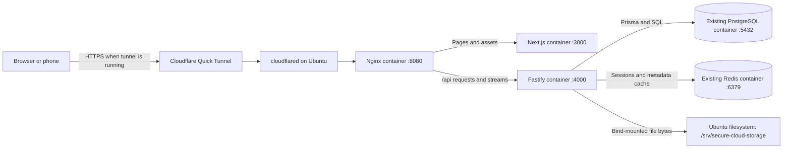
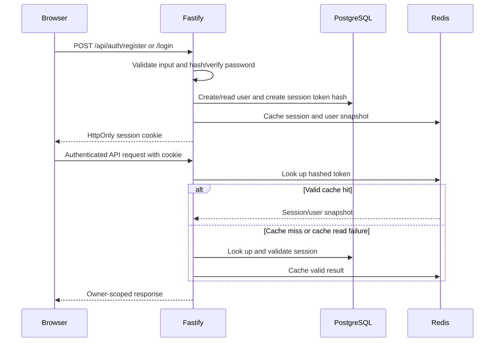
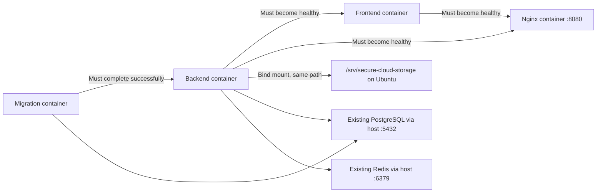
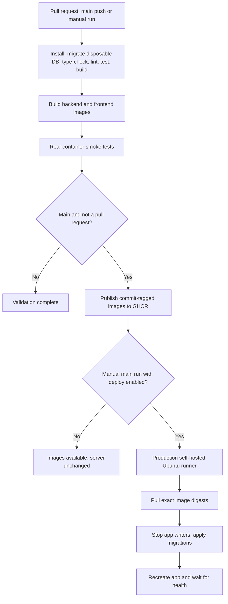
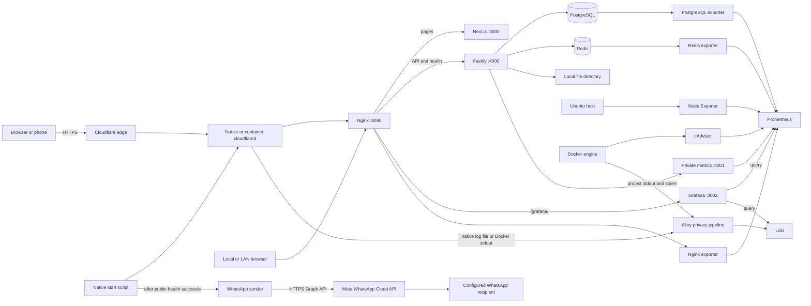

# Secure-Cloud: current code flow and infrastructure

**Source/configuration review: 12 September 2026 (PKT).** Runtime health was not rechecked for this documentation update. Historical observations are recorded separately in [monitoring implementation status](monitoring/IMPLEMENTATION_STATUS.md).

This document describes the first-party application code, database schema, storage adapter, frontend, Docker files, tests and GitHub Actions workflow. The topology below describes the checked-in configuration, not a claim that every container or public tunnel is currently running. Dependencies and generated build output are not application source. No credentials, session tokens or user file contents are reproduced here.

## 1. What the project does

Secure-Cloud is a single-server file storage application. Next.js renders the interface; the browser calls a Fastify API for authentication and file operations. PostgreSQL stores account/session data and file metadata. Actual uploaded bytes live in `/srv/secure-cloud-storage` on the Ubuntu laptop. Redis caches sessions and selected metadata and supports authentication rate limiting.

The enforced quota is **5 GiB per user**, exactly `5368709120` bytes. Uploads and downloads pass through the backend. There is no active object-storage SDK, remote upload URL generation, or external file-storage service in the runtime code.



The browser uses the relative API base `/api`, so mobile requests stay on the same public hostname as the page. Nginx sends `/api/*` and `/health` to Fastify, `/grafana/*` to Grafana, and ordinary page paths to Next.js. Next.js also supplies an `/api/*` rewrite to the local backend for direct development access. No business logic has moved out of Fastify.

## 2. Full infrastructure inventory

The Ubuntu laptop is the application, database and storage server. Root
[compose.yaml](compose.yaml) includes [monitoring/compose.yaml](monitoring/compose.yaml)
under project `secure-cloud`: **15 default services** (including the one-shot
migration job), plus optional `cloudflared` under profile `tunnel`. Native
WhatsApp/tunnel scripts run outside Docker. No AWS, S3, EC2, Kubernetes or external
object storage is provisioned. `infra/ec2.tf` is an empty placeholder.

| Service | Configured image/runtime | Listener / exposure | Responsibility |
| --- | --- | --- | --- |
| `nginx` | `nginx:stable-alpine` | Host port 8080; private status 127.0.0.1:8082 | Pages, API streams, health, Grafana proxy |
| `frontend` | Local/GHCR Next.js image, Node 22 | 0.0.0.0:3000 | Production standalone UI |
| `backend` | Local/GHCR Fastify image, Node 22 | 0.0.0.0:4000; metrics 127.0.0.1:4001 | Authentication, metadata, file streams, quota |
| `migrate` | Same image as backend | No listener; exits after completion | `prisma migrate deploy` |
| `postgres` | `postgres:17-alpine` | Published only at 127.0.0.1:5432 | Prisma database |
| `redis` | `redis:7.4-alpine` | Published only at 127.0.0.1:6379 | Sessions/cache/rate limits; AOF enabled |
| `prometheus` | `prom/prometheus:v3.14.0` | 127.0.0.1:9090 | Metric scraping/storage and alert rules |
| `grafana` | `grafana/grafana:13.2.1` | 127.0.0.1:3002; HA bind 127.0.0.1:9094 | Dashboards; exposed through `/grafana/` |
| `loki` | `grafana/loki:3.7.7` | 127.0.0.1:3100; gRPC 127.0.0.1:9096 | Filesystem-backed log storage |
| `alloy` | `grafana/alloy:v1.19.2` | 127.0.0.1:12345 | Docker/native log collection and privacy filtering |
| `node-exporter` | `prom/node-exporter:v1.12.1` | 127.0.0.1:9100 | Ubuntu CPU/RAM/disk/filesystem/network |
| `cadvisor` | `ghcr.io/google/cadvisor:0.60.5` | 127.0.0.1:8083 | Docker resource metrics |
| `nginx-exporter` | `nginx/nginx-prometheus-exporter:1.5.3` | 127.0.0.1:9113 | Converts private stub status to metrics |
| `postgres-exporter` | `quay.io/prometheuscommunity/postgres-exporter:v0.20.1` | 127.0.0.1:9187 | Database stats using `secure_cloud_monitor` |
| `redis-exporter` | `oliver006/redis_exporter:v1.91.1-alpine` | 127.0.0.1:9121 | Redis availability, cache and command stats |
| `cloudflared` (optional container) | `cloudflare/cloudflared:2026.9.0` | Outbound tunnel; metrics 127.0.0.1:20241 | Alternative to native tunnel; no WhatsApp sender |

Application and monitoring services use Linux **host networking**. PostgreSQL and
Redis use the Compose bridge network with localhost-only published ports. Blank
port mappings for host-network containers are expected. Ports 3000 and 4000 are
not restricted to loopback by current application configuration; Nginx is the
intended browser entry point, not a firewall protecting those direct listeners.
Cloudflare Quick Tunnel uses an outbound connector to `localhost:8080`; this
configuration does not require DNS proxy records or router port forwarding.

### Persistence and ownership

| Data | Host/volume | Container destination | Lifecycle |
| --- | --- | --- | --- |
| User file bytes | `/srv/secure-cloud-storage` bind mount | Same path in backend | Must already exist; independent of containers |
| PostgreSQL | External `self-cloud-prj_postgres_data` | `/var/lib/postgresql/data` | Existing database retained |
| Redis | External `self-cloud-prj_redis_data` | `/data` | AOF/cache state retained |
| Prometheus | `secure-cloud_prometheus_data` | `/prometheus` | Named monitoring volume |
| Grafana | `secure-cloud_grafana_data` | `/var/lib/grafana` | Login/configuration database and local state |
| Loki | `secure-cloud_loki_data` | `/loki` | Chunks, indexes, compactor state |
| Alloy | `secure-cloud_alloy_data` | `/var/lib/alloy/data` | Log collection positions |
| Monitoring credentials | `monitoring/runtime/` by default | Selected env files/secret mount | Ignored by Git and Docker build context |
| Native tunnel state | `.runtime/` by default | Read-only `/var/log/secure-cloud-tunnel` in Alloy | Log, URL, PID, process identity, operation lock |

Changing the Compose project name changes the default monitoring volume names.
Database container names remain `self-cloud-prj-postgres-1` and
`self-cloud-prj-redis-1`, even though the current project manages them.
`APP_UID`/`APP_GID` default to 1000 for application containers and must match storage
permissions. The setup does not repartition the laptop or put user bytes in a
Docker named volume. Coordinate PostgreSQL and file-directory backups; a database
backup alone does not contain uploaded content. No automated backup scheduler or
cross-filesystem transaction is implemented.

### Nginx route map

| Incoming path | Destination |
| --- | --- |
| `/api/*` | Fastify :4000, preserving `/api`; buffering/cache disabled |
| `/health` | Fastify :4000/health |
| `/grafana` | Redirect to `/grafana/` |
| `/grafana/*` | Grafana :3002, including WebSocket upgrade headers |
| `/metrics` | 404; API metrics use a separate private socket |
| Other paths | Next.js :3000 |
| `127.0.0.1:8082/stub_status` | Nginx status for its exporter only |

Nginx accepts bodies up to 5 GiB and uses long upload/proxy timeouts. It forwards
host and scheme information, including Cloudflare's HTTPS scheme. Local Nginx
TLS certificates are not configured: public TLS terminates at Cloudflare. Set
`GRAFANA_ROOT_URL` for a stable/public hostname and `GRAFANA_COOKIE_SECURE=true`
when accessing Grafana exclusively over HTTPS. Grafana requires its own login;
Secure Cloud sessions do not authenticate it.

## 3. Where the code lives

| Area | Main files | Responsibility |
| --- | --- | --- |
| Workspace commands | [package.json](package.json) | Starts both development workspaces; runs builds, type-checks and backend tests |
| API entry point | [backend/src/server.ts](backend/src/server.ts) | Starts listening and handles shutdown signals |
| API composition | [backend/src/app.ts](backend/src/app.ts) | Creates services, registers security plugins, error handling and routes |
| Configuration | [backend/src/config.ts](backend/src/config.ts) | Loads dotenv values and validates them with Zod |
| Authentication | [backend/src/plugins/auth.ts](backend/src/plugins/auth.ts), [auth routes](backend/src/modules/auth/routes.ts) | Password verification, session creation, cookie authentication and logout |
| File operations | [backend/src/modules/files/routes.ts](backend/src/modules/files/routes.ts) | Upload, search/list, details, download, move and permanent delete |
| Disk operations | [backend/src/lib/storage.ts](backend/src/lib/storage.ts) | Safe UUID paths, streamed writes/reads and unlink |
| Folder operations | [backend/src/modules/folders/routes.ts](backend/src/modules/folders/routes.ts) | Logical folder tree, creation, rename and empty-folder deletion |
| Quota display/recalculation | [backend/src/modules/storage/routes.ts](backend/src/modules/storage/routes.ts) | Storage summary and per-user recalculation |
| Redis | [redis.ts](backend/src/lib/redis.ts), [cache.ts](backend/src/lib/cache.ts) | JSON cache access, key naming and invalidation |
| Response/error helpers | `backend/src/lib/serialize.ts`, `errors.ts`, `types.d.ts` | BigInt conversion, application errors and Fastify type extensions |
| Database | [backend/prisma/schema.prisma](backend/prisma/schema.prisma), `backend/prisma/migrations/` | Models and versioned schema changes |
| Offline maintenance | [recalculate-storage.ts](backend/src/scripts/recalculate-storage.ts) | Rebuilds usage counters from file metadata for all users |
| Frontend shell | [frontend/components/app-shell.tsx](frontend/components/app-shell.tsx) | Navigation, session lookup, logout, mobile menu and theme |
| Login/register | [frontend/components/auth-form.tsx](frontend/components/auth-form.tsx) | Shared form and API submission |
| File interface | [frontend/components/file-manager.tsx](frontend/components/file-manager.tsx) | Folder selection, upload progress, search, sorting, pagination and deletion modal |
| Storage interface | [frontend/components/storage-summary.tsx](frontend/components/storage-summary.tsx) | Usage/count display fetched from `/api/storage` |
| Browser networking | [frontend/lib/api.ts](frontend/lib/api.ts) | Credentialed fetch, binary upload through XHR and byte formatting |
| Styling | `frontend/app/globals.css`, `frontend/postcss.config.mjs` | Tailwind 4, light/dark CSS variables and terminal-style visual components |
| Next.js configuration | [frontend/next.config.ts](frontend/next.config.ts) | Standalone builds, workspace file tracing and separate dev/build directories |
| Deployment | [compose.yaml](compose.yaml), both workspace Dockerfiles, [deploy/README.md](deploy/README.md) | Application containers, migrations and deployment instructions |
| Automation | [pipeline.yml](.github/workflows/pipeline.yml), `.github/dependabot.yml` | CI, image publication, optional deployment and dependency-update configuration |
| Tests | `backend/test/`, [scripts/smoke-containers.sh](scripts/smoke-containers.sh), [scripts/smoke-http.mjs](scripts/smoke-http.mjs) | Filesystem, API/database and actual-container checks |
| Infrastructure placeholder | `infra/ec2.tf` | Empty, zero-byte file; it provisions no infrastructure |

## 4. Startup and request handling

### Current Docker startup

Compose waits for PostgreSQL and Redis health before running the migration container; after it exits successfully, the backend then starts, the frontend waits for backend health, and Nginx waits for both application containers. Container commands run compiled backend JavaScript and the standalone Next.js server. `npm run dev` is an alternative development mode, not how the current containers run. Do not run it concurrently on the same ports.

### Alternative development startup

`npm run dev` at the root starts the backend and frontend workspace development commands in parallel using the shell. The backend's `predev` first runs `prisma migrate deploy` and `prisma generate`; then `tsx watch src/server.ts` starts it. The frontend runs `next dev`.

This is a development convenience command, not a production process supervisor. Failure of one workspace does not automatically manage the other workspace's lifecycle.

The backend startup sequence is:

1. Load configuration and require a database URL plus an authentication secret of at least 32 characters.
2. Create Prisma, the local-storage adapter and the Redis client.
3. Create/check the storage directory and reject a root path that resolves through symlinks.
4. Register Helmet, cookies, credentialed CORS and rate-limit support.
5. Apply the configured origin policy to CORS and state-changing requests. With `FRONTEND_ORIGIN=*`, valid HTTP(S) origins are accepted and reflected for credentialed CORS; explicit origin lists still restrict access.
6. Register the error handler before authentication and route plugins.
7. Listen on port 4000 by default.

Zod failures produce structured 400 responses, known `AppError` instances retain their intended status, uniqueness conflicts become 409, and unexpected errors are logged with a generic 500 response to the browser. Requests without an Origin remain supported. Wildcard mode rejects invalid/opaque origins and does not send a literal wildcard response with credentials. Fastify sends the actual allowed origin with credentials and `Vary: Origin`; Nginx does not add duplicate CORS headers.

On SIGTERM/SIGINT the API closes Fastify and its owned Prisma/Redis connections. Compose grants the backend five minutes before forced shutdown.

### Frontend page flow

| Page | Current behavior |
| --- | --- |
| `/` | Redirects to `/dashboard` |
| `/login`, `/register` | Shared authentication form |
| `/dashboard` | Storage summary plus file manager limited to six files per page in the selected folder |
| `/files` | File manager with search, type filter, sorting, grid/list view and 30-file pagination |
| `/files/:id` | Fetches metadata for one file; offers download |
| `/settings` | Storage summary and static explanatory copy; no account-editing form |
| `/trash` | Informational placeholder; there is no recoverable trash |

The `(protected)` layout wraps pages in `AppShell`. The shell calls `/api/auth/me` in a browser effect and redirects to `/login` on failure. Backend authentication and ownership checks enforce data access; the frontend layout itself is not server-side authorization middleware.

The root layout supplies the global Sonner toast UI. Theme choice is stored in browser `localStorage`. Next.js uses `.next-dev` for development and `.next` for production so a production build does not overwrite the running dev server's chunks.

## 5. Authentication flow



Registration validates the name/email and requires a 12–128 character password containing uppercase, lowercase, a number and a symbol. It hashes the password with Argon2id and transactionally creates the user plus the root folder `My Files`.

Sessions use a random 32-byte token. The browser receives that token in `selfcloud_session`; PostgreSQL stores its SHA-256 hash. Cookies are `HttpOnly`, `SameSite=Lax`, and `Secure` in production. Session expiry defaults to 30 days. These are opaque sessions, not JWTs.

Login is limited to 10 requests per 15 minutes; registration to five, with higher limits in test mode. Rate limiting uses Redis when its client is supplied. Cache operations often fall back to PostgreSQL or ignore cache-write failures, but that does not make Redis irrelevant to authentication rate limiting.

Logout removes the database session, attempts to invalidate the Redis entry and clears the cookie. Session cache hits use a saved user snapshot; `/auth/me` does not necessarily reflect a just-updated storage counter. Upload quota enforcement does not depend on that snapshot.

## 6. File upload flow

Selecting or dropping multiple files uploads them sequentially in the file manager. `uploadFile()` uses XMLHttpRequest so the interface can display transfer progress, sends cookies, and posts the raw file body as `application/octet-stream`.

The filename, declared size, MIME type and folder ID are query parameters. The original filename is metadata, not part of the disk path.

```mermaid
sequenceDiagram
    participant B as Browser
    participant A as Fastify
    participant P as PostgreSQL
    participant D as Local filesystem
    B->>A: POST /api/files/upload with binary stream
    A->>A: Authenticate and validate metadata
    A->>P: Verify folder ownership
    A->>P: Atomically reserve declared bytes if quota allows
    alt Not enough available quota
      A-->>B: 413 QUOTA_EXCEEDED
    else Reservation succeeds
      A->>D: Stream to exclusive UUID file; count bytes
      alt Exact-size write succeeds
        A->>P: Transaction: create File, release reservation, increment usage
        A-->>B: 201 with file metadata
      else Write or metadata commit fails
        A->>D: Remove partial/uncommitted content when possible
        A->>P: Release reservation
        A-->>B: Error
      end
    end
```

The atomic SQL condition is:

```text
storageUsed + storageReserved + incomingSize <= 5368709120
```

PostgreSQL evaluates it against the current row. Concurrent requests cannot each spend the same remaining quota based on stale browser/session data.

For a successful 100-byte upload:

| Stage | storageUsed | storageReserved |
| --- | ---: | ---: |
| Initially | 0 | 0 |
| Upload accepted | 0 | 100 |
| Content verified and metadata committed | 100 | 0 |

The writer uses a generated UUID v4 such as `/srv/secure-cloud-storage/<uuid>`. It opens exclusively with `O_EXCL`, refuses symlinks with `O_NOFOLLOW`, and creates files with mode `0600`. A streaming transform rejects bytes beyond the declared size; a short upload also fails verification. Empty files are accepted. The default maximum single-file size is 5 GiB.

After committing, the API invalidates relevant cached metadata. The browser refreshes the file list. XHR progress describes bytes transferred, so 100% transfer is not itself confirmation that the final database transaction has committed.

## 7. List, search, folders, download and delete

### Listing and search

`GET /api/files` always scopes results to the authenticated user. Optional folder filtering scopes the browser's normal search to its selected folder. Filename search is case-insensitive. Supported type filters are image, video, audio, document and archive; the document filter specifically includes PDF, MS Word and plain text. Sorting supports name, size and creation date. The route translates the UI's `name` sort to Prisma's `originalName` field.

The browser debounces search by 300 ms. Results and pagination counts come from PostgreSQL, not a separate search service or Redis list cache.

### Folders and moves

Folders are rows connected by `parentId`. Creating a folder defaults to the user's root when no parent is given, and verifies ownership of the parent. A folder name does not create a Linux directory.

The API supports rename, empty-folder deletion and moving a file by changing `File.folderId`. The root cannot be renamed or deleted through those routes. Non-empty folders cannot be deleted. Moving a file does not move its bytes on disk.

The current UI offers folder creation and selecting child folders. It does not expose all of the API's rename/delete/move capabilities. The navigation link `/files?folders=true` currently reaches the same file manager; that query parameter is not consumed as a separate folders-only mode.

### Download

Both download buttons navigate to `/api/files/:id/download`. The API looks up the file by both ID and user ID, opens its UUID storage key, and streams bytes as an attachment. It encodes the original filename in `Content-Disposition`, supplies the stored length, and uses `Cache-Control: private, no-store`. There is no intermediate signed URL.

### Permanent deletion

The API verifies ownership, unlinks the filesystem entry, then transactionally deletes metadata and decrements usage only if a row was actually removed. Concurrent/repeated requests cannot decrement usage twice. Missing content is tolerated for retrying deletion; other disk-deletion errors leave metadata and quota untouched.

Filesystem changes and PostgreSQL commits cannot form one shared transaction. A crash after unlink but before the database commit can leave metadata for missing content; retrying deletion can finish that operation. A crash during upload can leave an orphan file or reservation. The project has documented offline recovery, not an automatic background reconciler.

## 8. Database and quota reporting

[Prisma schema](backend/prisma/schema.prisma) defines four current models:

| Model | Main information |
| --- | --- |
| `User` | Identity, password hash, quota limit, used bytes and reserved bytes |
| `Session` | User relation, hashed token, expiry and timestamps |
| `Folder` | Owner, parent, name and root flag |
| `File` | Owner, folder, original name, UUID storage key, MIME type, size and timestamps |

PostgreSQL contains no file-byte/blob column. Routes generate UUID file IDs/keys; user and folder IDs use CUIDs. Size and quota values are BigInts. `jsonSafe()` serializes them as strings for API responses; the browser converts them to numbers for presentation.

The migration sequence is initial schema → foreign-key adjustments → local-storage migration. Historical migrations retain the old column names for upgrade compatibility. The local migration renames the file storage column, removes `UploadIntent` and its enum, sets existing users to 5 GiB and clears old reservations. It does not download or transfer legacy file bytes.

`GET /api/storage` returns quota, used/available bytes and file/folder counts. Its displayed available space is `storageLimit - storageUsed`; it does not subtract in-flight reservations, although upload enforcement does.

`POST /api/storage/recalculate` locks the current user row, sums file metadata and updates usage transactionally. The CLI recalculation script processes all users without that same transaction wrapper; run it during the documented offline maintenance window. Neither recalculation method checks that the underlying content exists or clears orphan files/reservations.

Redis keys are prefixed with `selfcloud:` and cover sessions, storage summaries, folder lists, individual folders and individual files. Metadata TTL defaults to 60 seconds. Mutation routes invalidate selected keys, but related cached views can lag where invalidation does not cover every relationship, for example the old folder's cached contents after a move.

## 9. API reference

All routes below require a session except register, login and health.

| Method | Route | Result |
| --- | --- | --- |
| POST | `/api/auth/register` | Create account/root folder and session |
| POST | `/api/auth/login` | Verify password and create session |
| POST | `/api/auth/logout` | Remove session and clear cookie |
| GET | `/api/auth/me` | Return authenticated user snapshot |
| POST | `/api/files/upload` | Stream and commit one file |
| GET | `/api/files` | Owner-scoped list/search/filter/sort/page |
| GET | `/api/files/:id` | File metadata and folder summary |
| GET | `/api/files/:id/download` | Attachment stream |
| PATCH | `/api/files/:id` | Move file to another owned folder |
| DELETE | `/api/files/:id` | Permanent content and metadata deletion |
| GET | `/api/folders` | Owned folder list |
| POST | `/api/folders` | Create logical folder |
| GET | `/api/folders/:id` | Folder with children/files |
| PATCH | `/api/folders/:id` | Rename non-root folder |
| DELETE | `/api/folders/:id` | Delete empty non-root folder |
| GET | `/api/storage` | Usage and counts |
| POST | `/api/storage/recalculate` | Rebuild current user's usage from metadata |
| GET | `/health` | Basic API status and Redis client state |

## 10. Docker configuration available in the repository

[compose.yaml](compose.yaml) defines the four application/proxy services and includes eleven additional default infrastructure services plus an optional tunnel. Application dependencies are:



Application and monitoring services use Linux host networking; PostgreSQL/Redis are bridge-network services published only on localhost. The included monitoring Compose file preserves their original external named volumes and adds persistent monitoring volumes. Application ports remain 3000/4000; Nginx remains the browser/tunnel entry point on 8080.

The backend image builds TypeScript and Prisma, removes development dependencies, and retains the Prisma CLI because the migration service needs it. Its default command runs compiled JavaScript directly; Compose handles migrations separately. The frontend image copies Next.js standalone output, static assets and public assets into its runtime stage. `NEXT_PUBLIC_API_URL` is a frontend build argument, not a runtime-switchable browser setting.

Both application images default to the non-root `node` user. The separate Nginx service uses the official Nginx image and its default user configuration. For backend/frontend, Compose allows `APP_UID`/`APP_GID` overrides to match the upload directory owner, drops capabilities and prevents privilege escalation. The upload directory is a bind mount at the same path and must already exist on the host. Environment values come from `APP_ENV_FILE` (default `backend/.env`); the deployment job explicitly uses `/etc/secure-cloud/backend.env`.

Nginx is configured with [deploy/nginx/default.conf](deploy/nginx/default.conf). It preserves the `/api` prefix, forwards host/protocol information, supports WebSocket upgrades, disables API caching and buffering, and allows bodies up to 5 GiB. The configured Quick Tunnel terminates public HTTPS at Cloudflare and forwards to local Nginx over HTTP; local TLS certificate provisioning is not part of this setup. See [Nginx and Cloudflare](deploy/NGINX_CLOUDFLARE.md). Cloudflare request limits can still reject a large upload before it reaches Nginx; this app does not implement resumable/chunked uploads.

## 11. GitHub Actions flow



The `checks` and `images` jobs use GitHub-hosted runners. Integration tests receive an explicit disposable PostgreSQL database. Images are smoke-tested before publication. Frontend builds default to `/api`; `NEXT_PUBLIC_API_URL` is an optional override and should not point to localhost for mobile use. Publication uses `GITHUB_TOKEN`, and creates `ghcr.io/<owner>/<repo>-backend:<commit>` and the matching frontend image. Deployment uses recorded registry digests.

Deployment is manual, only from `main`, with the `deploy` input enabled. It needs a runner labelled `self-hosted`, `Linux`, `X64`, `secure-cloud`, plus the `production` environment and the host configuration file. Deployments are serialized. It does not automatically reverse database migrations after a failure.

Dependabot is configured for weekly GitHub Actions and Docker updates. The existence of these YAML files does not establish that the repository has been pushed, Actions has run, images have been published or a production runner is connected; those remote facts were not checked in this inspection.

## 12. Current gaps and misleading UI/documentation

These findings describe the inspected code; this documentation task did not modify application behavior.

| Finding | What is actually true |
| --- | --- |
| Registration text says “10 GB” | Backend configuration, registration and the database default enforce 5 GiB |
| Settings text mentions signed links and bucket credentials | Downloads are authenticated local filesystem streams |
| UI labels include “ENCRYPTED NODE”, “TLS 1.3” and “ALL SYSTEMS NOMINAL” | These are static labels; this code does not implement file encryption at rest, negotiate TLS itself or derive those labels from health checks. Host disk encryption was not inspected |
| UI mount text says `/users/current/files` | Actual files live directly under `/srv/secure-cloud-storage/<uuid>` |
| Existing database volumes retained | One-time adoption moves the original databases into the current Compose project without replacing data; stopped legacy containers must not run concurrently |
| Storage directory is `0755` | The adapter requests `0700` only when creating a directory; it does not change permissions on an existing one. New files are opened with `0600` |
| Storage summary says “LIVE” | It fetches once on mount, with no polling or upload/delete refresh subscription; the display may remain stale until remounted |
| Session snapshot contains usage values | Cached `/auth/me` data can lag; quota admission uses current SQL counters instead |
| Trash and settings navigation exist | Recoverable trash, password reset/change and account management are not implemented |
| Folder API exceeds folder UI | Rename/delete/move endpoints exist without corresponding controls in the current file manager |
| Detail lookup errors show a toast | The detail page leaves `file` null, so the loading placeholder remains; it has no dedicated not-found/error view |
| `/health` returns status OK | It is not a complete readiness check for the database, cache or disk |
| File metadata and disk have separate commits | Crash recovery/orphan cleanup remains an offline operational task |

The API also trusts the client-declared MIME classification for filtering; it validates the allowed category and byte count, but does not inspect magic bytes or scan content. Physical disk capacity is distinct from per-user quota: the quota guard does not measure free filesystem space.

## 13. Tests and verification scope

There are **35 tests: 12 filesystem/config tests, four CORS tests, three observability tests and 16 database integration tests**. The CORS tests cover changing tunnel origins, credentialed preflights, explicit allowlists, invalid origins and continued authentication enforcement. They cover path traversal, symlinks, exact-size writes, interruptions, empty files, permissions, authentication, ownership, quota concurrency, filtering/folders and delete accounting. Integration tests are skipped without `TEST_DATABASE_URL` and clear application tables in the explicitly supplied test database.

The smoke script builds an isolated Docker network, starts disposable PostgreSQL/Redis plus the application and Nginx containers, mounts a temporary upload directory, applies migrations, exercises credentialed CORS preflights and HTTP registration/upload/list/download/quota/delete and page responses through Nginx, and checks graceful backend shutdown. Its cleanup removes the temporary containers/network/directory. It does not operate on the live uploaded-file directory.

Earlier monitoring work recorded 35 passing tests, application builds and live application checks. Those are historical results, not a fresh health report. This update reviewed repository sources only; it did not run tests, deploy containers, open a tunnel or send WhatsApp messages. The frontend workspace still defines `lint` as `next lint`; the configured CI explicitly runs backend ESLint plus Next's production build checks rather than claiming a standalone frontend ESLint pass.

For operating commands, use [README.md](README.md) and [deploy/README.md](deploy/README.md). Section 2 describes configured infrastructure; neither present container health nor remote Actions execution was verified in this update.

## 14. Monitoring architecture and data flow



[Prometheus configuration](monitoring/prometheus/prometheus.yml) defines ten jobs:
backend, node, cAdvisor, Nginx exporter, PostgreSQL exporter, Redis exporter,
Prometheus, Grafana, Loki and Alloy. Scrape and rule evaluation intervals are
30 seconds. The optional cloudflared metrics port is not a configured scrape job.

[Fastify observability](backend/src/lib/observability.ts) records request counts
by method/route template/status, latency histograms, 4xx/5xx errors, upload outcomes
and failures, download outcomes and authentication failures. Process metrics use
`secure_cloud_` prefixes. Routes are templates rather than filenames, user IDs or
raw URLs. Downloads measure HTTP response outcomes, not whether the recipient
saved the complete file.

Every 60 seconds, separate aggregate reads report registered users, file counts,
used/reserved bytes, aggregate quotas and filesystem available bytes. Collection
success and last-success time reveal stale data. These observations do not update
quota metadata or participate in upload admission. Filesystem free space includes
the effects of all other laptop data, so it differs from application usage.

[Alloy configuration](monitoring/alloy/config.alloy) discovers containers with
Compose project label `secure-cloud` every 15 seconds. It tails their stdout/stderr
and the native `.runtime/cloudflared.log`, then sends filtered events to Loki.
Docker logs have job `secure-cloud-docker`; native tunnel logs have job
`secure-cloud-native`; both carry a `service` label. Other Compose projects are
not automatically collected. URL/PID/identity files and `.env` credentials are
not selected as log inputs.

Backend/Nginx HTTP events retain approved method, route, status and duration
fields. Other messages become generic info or warning/error events: raw SQL,
exceptions, request bodies, headers, tokens and URLs are not forwarded into Loki.
This intentionally limits diagnostic detail. Local Docker logs can still contain
third-party output and should be treated as privileged. Nginx access logs are
JSON; raw error logging is limited to critical severity. Backend framework
request/response/error serializers also remove sensitive details.

Grafana automatically provisions Prometheus and Loki data sources, with UIDs
`prometheus` and `loki`. Seven checked-in dashboards cover **host, containers,
Nginx, backend, PostgreSQL, Redis and storage** and include related log panels.
Dashboard edits belong in [dashboard JSON](monitoring/grafana/dashboards).
Nginx status/error panels combine exporter metrics with LogQL because stub status
does not expose per-response HTTP status counters.

### Retention, limits and trust boundaries

| Component | Configured limits |
| --- | --- |
| Prometheus | Seven days / 1 GB TSDB block retention; WAL/head need additional space |
| Loki | 72-hour retention, two-hour deletion delay, 48 MB combined caches |
| Docker logs | 5 MB × two files per managed container |
| Native tunnel log | Generated logrotate config: 5 MB, two rotations; host scheduling required |
| Monitoring RAM | Caps total 1,248 MiB across nine monitoring services; optional tunnel adds 128 MiB |

Caps are not reserved memory or measured consumption. Application, database and
Redis services have no memory caps in current Compose. Loki retention is not a
hard disk quota. Prometheus rules cover missing targets, low filesystem space,
API errors and stale storage metrics; no Alertmanager/email/paging destination is
configured. WhatsApp currently sends tunnel notifications, not monitoring alerts.

Collectors assume a trusted Ubuntu host. Alloy has a read-only Docker socket
mount, which does **not** make the Docker API read-only. cAdvisor is privileged and
mounts host runtime/kernel/Docker paths; Node Exporter uses host PID visibility and
a read-only host filesystem mount. Monitoring ports bind to loopback and are not
published through Nginx, except Grafana. This is a single-host deployment without
replication or failover.

## 15. Cloudflare and WhatsApp lifecycle

The native entry points are [start](scripts/start-cloudflare.sh),
[stop](scripts/stop-cloudflare.sh), [shared lifecycle helpers](scripts/cloudflare-common.sh)
and [notification sender](scripts/notify-whatsapp.mjs). They run as the Ubuntu
user, outside Compose. Node 22+, project dependencies, curl, cloudflared and flock
are required; Meta account/token/template provisioning is external to this repo.

1. Acquire a shared exclusive operation lock and validate WhatsApp configuration.
2. Refuse duplicate tunnels or a live PID with mismatched ownership information.
3. Check local Nginx `/health`, start cloudflared with `nohup`, and capture its
   generated `https://…trycloudflare.com` origin.
4. Wait for public `/health` to return 200. Save the URL and keep the healthy tunnel.
5. The sender checks public health again and submits URL/health information to
   Meta. A notification failure leaves the healthy tunnel running.

Stop verifies PID, process start time, boot identity, process name and owner before
signaling it. The tunnel survives terminal closure, but no boot-time systemd unit
or persistent named tunnel is configured. Legacy PID files without identity
metadata require manual inspection before controlling an already-running process.
The optional Compose `tunnel` profile is an alternative that restarts with Docker;
it does not invoke the WhatsApp sender. Do not run both alternatives together.

WhatsApp settings: `WHATSAPP_ACCESS_TOKEN`, `WHATSAPP_PHONE_NUMBER_ID`,
`WHATSAPP_RECIPIENT`, optional `WHATSAPP_API_VERSION` (default `v23.0`),
`WHATSAPP_TEMPLATE_NAME` and `WHATSAPP_TEMPLATE_LANGUAGE` (default `en_US`).
Without a template the sender submits a text message. Template mode requires an
approved template with two positional body parameters: the full URL and health
status. Header/button/named parameters are not implemented. Config parsing uses
dotenv, with process environment taking precedence; credentials are not passed
as command-line arguments. Only numeric provider error codes are reported.

A message ID means API acceptance, not confirmed delivery. There is no delivery
status webhook and no automatic retry after an ambiguous timeout. A manual retry
can reuse the saved URL without restarting cloudflared. Full setup, messaging
window requirements and commands: [WhatsApp operations](deploy/WHATSAPP.md).

## 16. Environment sources, setup and deployment operations

| Source / variable | Consumer and behavior |
| --- | --- |
| Root `.env` | Compose interpolation and native WhatsApp configuration; not automatically the backend env file |
| `APP_ENV_FILE` | Backend/migrate and monitoring setup; defaults to `backend/.env` |
| `DATABASE_URL`, `REDIS_URL`, `AUTH_SECRET` | Backend database/cache/session configuration |
| `FRONTEND_ORIGIN` | Backend CORS; `*` reflects valid origins with credentials |
| `NEXT_PUBLIC_API_URL` | Frontend build argument; defaults to `/api`, requires rebuild to change |
| `APP_UID`, `APP_GID` | Application process ownership, default 1000 |
| `STORAGE_PATH`, `STORAGE_LIMIT_BYTES` | Compose explicitly sets `/srv/secure-cloud-storage` and `5368709120` |
| `METRICS_PORT` | Backend loopback metrics listener, default 4001; changing it also requires changing the scrape target |
| `MONITORING_RUNTIME_DIR` | Generated monitoring credentials, default `monitoring/runtime` |
| `GRAFANA_ROOT_URL`, `GRAFANA_COOKIE_SECURE` | Grafana public subpath URL and HTTPS cookie setting |
| `ENV_FILE`, `RUNTIME_DIR` | Native tunnel/WhatsApp configuration file and state directory |
| `CLOUDFLARED_RUNTIME_DIR` | Alloy bind source; must match custom native `RUNTIME_DIR` |
| `BACKEND_IMAGE`, `FRONTEND_IMAGE` | Local image tags or deployment GHCR digests |

[Monitoring preparation](monitoring/scripts/prepare.mjs) generates missing Grafana
and monitoring-role secrets, prepares env files/native logrotate configuration,
and grants `pg_monitor` to a dedicated PostgreSQL role. It requires a reachable
local database and the existing external database volumes. It is **not a fresh
host installer**. [Database adoption](monitoring/scripts/adopt-databases.sh) is a
one-time bridge from older project containers: it preserves volumes, retains old
containers stopped, and includes rollback if recreation fails. Never run old and
new PostgreSQL/Redis containers against the same volumes simultaneously.

There is currently **no `install.sh`** in the repository. The requested one-command
installer has not been implemented; prerequisites, storage ownership, initial
configuration and existing-database preparation remain operator setup steps.
Use [deployment setup](deploy/README.md) and [monitoring operations](monitoring/README.md).

After prerequisites and preparation, from the repository root:

```bash
docker compose build
docker compose up -d --wait --wait-timeout 180
docker compose ps --all
# Explicit existing migration command, when the database is available:
docker compose run --rm --no-deps migrate
# Native tunnel + WhatsApp (invokes Meta):
bash scripts/start-cloudflare.sh
bash scripts/stop-cloudflare.sh
# Notification retry only (also invokes Meta):
node scripts/notify-whatsapp.mjs send .env .runtime/cloudflare-url
```

Compose orders PostgreSQL/Redis health → successful migration → backend health →
frontend health → Nginx. Long-running services use `unless-stopped`; migrate uses
no restart. Backend gets five minutes to drain uploads at shutdown. Healthchecks
cover application endpoints, database readiness and images with an HTTP client;
minimal images rely on scrape/readiness checks. `/health` remains a liveness route
with Redis client state, not a full database/disk readiness transaction.

GitHub Actions performs dependency installation, Prisma generation/migrations,
type-check, backend lint, tests, builds and monitoring config validation. It builds
and smoke-tests application images, publishes main-branch images to GHCR, and
passes immutable digests to an optional manually requested deployment job. The
production runner must carry labels `self-hosted, Linux, X64, secure-cloud`, have
Docker access and preprovisioned `/etc/secure-cloud/backend.env` and
`/etc/secure-cloud/monitoring` files. Deployment pulls images, stops app writers,
runs migrations, then reconciles Compose with a health wait. It is not zero-downtime
or automatic rollback. GitHub infrastructure, published images and runner health
cannot be inferred from checked-in workflow YAML.

### Stop, recovery and remaining operational limits

`docker compose stop` preserves containers and data. `docker compose down` removes
project containers/network but retains volumes unless `-v` is supplied; external
database volumes are separate from project-managed monitoring volumes. Neither
command removes `/srv/secure-cloud-storage`. Native cloudflared is outside Compose
and must be stopped separately. Container deletion is not a backup and removes
data stored only in writable container layers.

Current unresolved runtime checks are recorded in
[monitoring implementation status](monitoring/IMPLEMENTATION_STATUS.md): cAdvisor
startup, all targets healthy together, final configuration reconciliation and
end-to-end log ingestion were not fully confirmed in prior work. WhatsApp delivery
has not been verified. This documentation update does not change those statuses.
No tests, containers, migrations, tunnels or notifications were intentionally run
for this documentation update.
