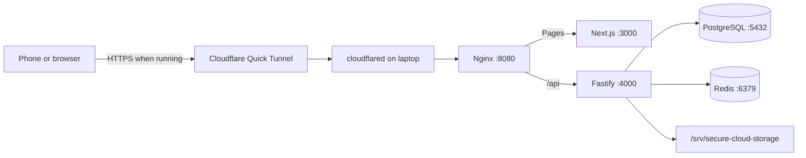

# Secure-Cloud project overview

Current monitoring and infrastructure: [monitoring/README.md](monitoring/README.md). Compose now includes Prometheus, Grafana, Loki, Alloy, host/container/service exporters and the existing databases (preserving their volumes). Grafana is served at `/grafana/`; monitoring and database ports bind only to localhost. Complete the documented one-time setup before starting this version.

Updated from the running laptop on **6 September 2026, 20:23 PKT**.

Secure-Cloud runs on one Ubuntu laptop. Nginx, the Next.js frontend and the Fastify backend are healthy Docker containers in the `secure-cloud` Compose project. Its Prisma migration job completed with exit code 0. PostgreSQL and Redis are now managed by the included monitoring Compose file, retain their original container names and external named volumes, and publish ports only on localhost.



No `cloudflared` process was running at the snapshot. Start public/mobile access separately:

```bash
cloudflared tunnel --url http://localhost:8080
```

The browser calls relative `/api` URLs, keeping requests on the same hostname as the page. `FRONTEND_ORIGIN=*` permits valid HTTP(S) origins; Fastify reflects the actual origin so cookie-based authentication works. Login uses Argon2id password verification and opaque HttpOnly session cookies. Production cookies require the public HTTPS flow.

Uploads stream through Nginx and Fastify into private UUID files on the laptop. PostgreSQL atomically reserves quota, and metadata plus used-byte accounting commit only after an exact-size write. The per-user limit is **5 GiB (`5368709120` bytes)**. Downloads verify ownership and stream the local content. Deletion permanently removes bytes and then transactionally removes metadata and decrements usage. Folders are database relationships, not physical disk directories.

PostgreSQL holds users, sessions, folders and file metadata; Redis holds cached sessions/metadata and supports rate limiting. Actual uploaded bytes use the host bind mount `/srv/secure-cloud-storage`, not a database blob or named Docker volume. Files are not sent to external object storage. Cloudflare's own request limits can be lower than the application's 5 GiB limit.

The GitHub Actions workflow validates code, runs database and Nginx container tests, publishes tested main-branch application images to GHCR, and supports optional manual deployment to a self-hosted Ubuntu runner. Remote Actions runs, registry publication and runner setup were not verified in this documentation update.

Local verification returned HTTP 200 for Nginx `/login`, HTTP 401 for unauthenticated `/api/files`, and an API health response with Redis `ready`. The latest implementation validation passed 32 tests, type-check, backend lint, both application image builds and Nginx smoke tests. Tests were not rerun for this documentation-only update.

- [Detailed architecture, code map and current runtime](CURRENT_ARCHITECTURE_AND_FLOW.md)
- [Operating commands and configuration](README.md)
- [Docker and GitHub Actions deployment](deploy/README.md)
- [Nginx and mobile/Cloudflare access](deploy/NGINX_CLOUDFLARE.md)

Monitoring implementation and deployment status: [monitoring/IMPLEMENTATION_STATUS.md](monitoring/IMPLEMENTATION_STATUS.md). This records what is implemented, what was observed running, and the remaining runtime work.
