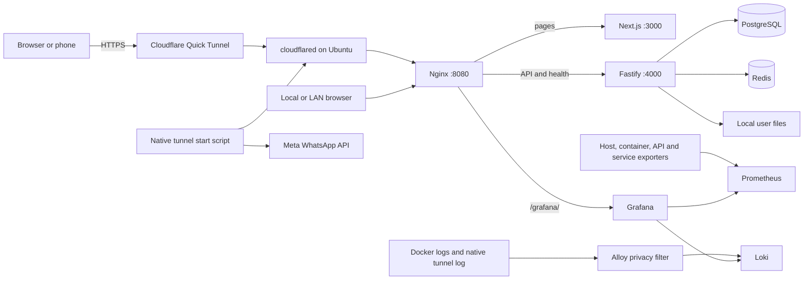

# Secure Cloud: project and infrastructure overview

**Updated from repository sources on 12 September 2026 (PKT).** This describes
configured infrastructure; it is not a fresh report of running containers.

Secure Cloud runs on one Ubuntu laptop. Docker Compose manages the Next.js
frontend, Fastify backend, Nginx, PostgreSQL, Redis and a local monitoring stack.
User file bytes remain in `/srv/secure-cloud-storage`. PostgreSQL contains users,
sessions, folders, file metadata and quota counters; Redis provides caching and
rate-limit support. Every user has a 5 GiB (`5368709120` bytes) quota.

## Application flow

The browser uses relative `/api` URLs, so mobile traffic stays on the public
hostname. Nginx routes API traffic and `/health` to Fastify, ordinary pages to
Next.js, and `/grafana/` to Grafana. Next.js has an API rewrite for direct development
access. Production and development builds use separate `.next` and `.next-dev`
directories.

Authentication uses Argon2id password hashing and opaque HttpOnly session cookies.
Production cookies are Secure. `FRONTEND_ORIGIN=*` reflects valid HTTP(S) origins
with credentials. Uploads reserve quota atomically in PostgreSQL, stream into safe
UUID paths, verify the exact size, then commit metadata and usage. Failures clean
up partial content/reservations. Downloads enforce ownership; permanent deletion
removes bytes and decrements metadata usage. Folders are logical database records.

## Complete infrastructure

Root `compose.yaml` includes `monitoring/compose.yaml`: 15 default services,
including the one-shot migration job, and an optional container tunnel.

| Layer | Components |
| --- | --- |
| Application | Nginx, Next.js, Fastify, Prisma migration job |
| Persistent services | PostgreSQL 17, Redis 7.4 with AOF |
| Metrics | Prometheus, Node Exporter, cAdvisor, Nginx/PostgreSQL/Redis exporters, private Fastify metrics |
| Logs | Alloy Docker discovery and native tunnel-file collection → Loki |
| Dashboards | Grafana with provisioned Prometheus/Loki sources and seven dashboards |
| Public access | Native cloudflared + WhatsApp scripts, or optional Compose `tunnel` profile |
| CI/CD | GitHub Actions checks/builds, GHCR images, optional self-hosted production deployment |

Application and monitoring containers use Linux host networking. PostgreSQL and
Redis publish only localhost ports 5432/6379. Monitoring binds to loopback; Grafana
is exposed through Nginx at **http://localhost:8080/grafana/**. Direct app listeners
3000/4000 still bind all interfaces; Nginx routing does not restrict those ports.
The full port/image inventory is in the [detailed architecture](CURRENT_ARCHITECTURE_AND_FLOW.md).

Existing PostgreSQL/Redis external volumes are preserved. Prometheus, Grafana,
Loki and Alloy have their own persistent volumes. User file bytes use the host
bind mount, not a named volume. Monitoring is capped at 1,248 MiB combined memory;
Prometheus retains seven days/1 GB of blocks, Loki retains 72 hours, and managed
Docker logs rotate at 5 MB × two files. Native tunnel log rotation needs a host
schedule. There is no external object storage, AWS deployment or Kubernetes.

## Cloudflare and WhatsApp

The native start script creates a Quick Tunnel to **Nginx port 8080**, waits for
public health, then sends its URL/status through Meta. Stop verifies process
identity before signaling it. The detached tunnel survives terminal closure;
there is no native boot-time service configured. Notification failures preserve
the healthy tunnel and can be retried without restarting it.

WhatsApp supports text or an approved two-body-parameter template. A successful
API response confirms acceptance, not delivery; delivery webhooks are absent.
Do not run the optional Docker tunnel simultaneously with the native scripts.
See [WhatsApp setup and commands](deploy/WHATSAPP.md). Monitoring tails the native
cloudflared log but does not send messages or collect WhatsApp credentials.

## Setup, deployment and current limits

Root `.env` supplies Compose interpolation/native WhatsApp configuration;
`backend/.env` is the default application env file. Monitoring credentials are
locally generated under `monitoring/runtime`. Production Actions expects
`/etc/secure-cloud/backend.env` and `/etc/secure-cloud/monitoring`.

There is **no `install.sh` yet**. Existing monitoring preparation requires a
reachable database and the original volumes; it is not a fresh-machine bootstrap.
After setup, Compose orders database health → migrations → backend → frontend →
Nginx. Updates can interrupt uploads; the backend has a five-minute shutdown grace
period. There is no automatic backup, HA/failover, delivery webhook or configured
alert-notification destination. The laptop remains a single point of failure.

Earlier work verified application operations and Grafana provisioning. Current
container status, final monitoring ingestion, cAdvisor and WhatsApp delivery were
not rechecked here; historical success must not be treated as present health.
See [implementation status](monitoring/IMPLEMENTATION_STATUS.md).

- [Full architecture, code flow, ports, volumes and environment map](CURRENT_ARCHITECTURE_AND_FLOW.md)
- [Application usage](README.md)
- [Docker and GitHub Actions deployment](deploy/README.md)
- [Nginx and Cloudflare routing](deploy/NGINX_CLOUDFLARE.md)
- [Monitoring operations and troubleshooting](monitoring/README.md)
- [WhatsApp integration](deploy/WHATSAPP.md)
